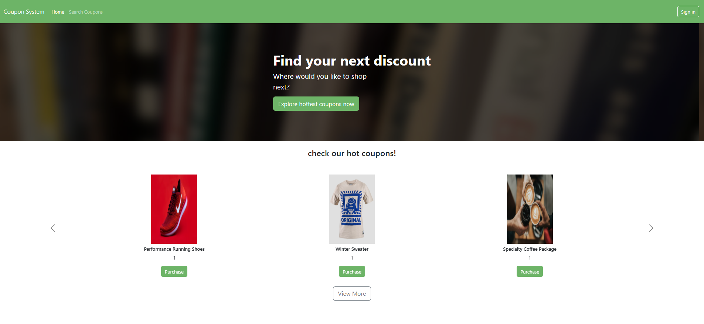
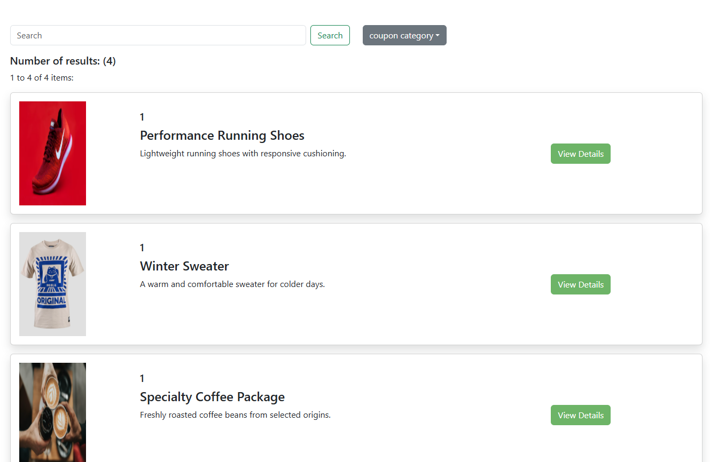
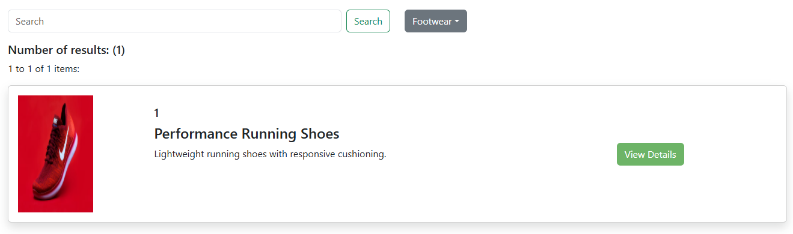
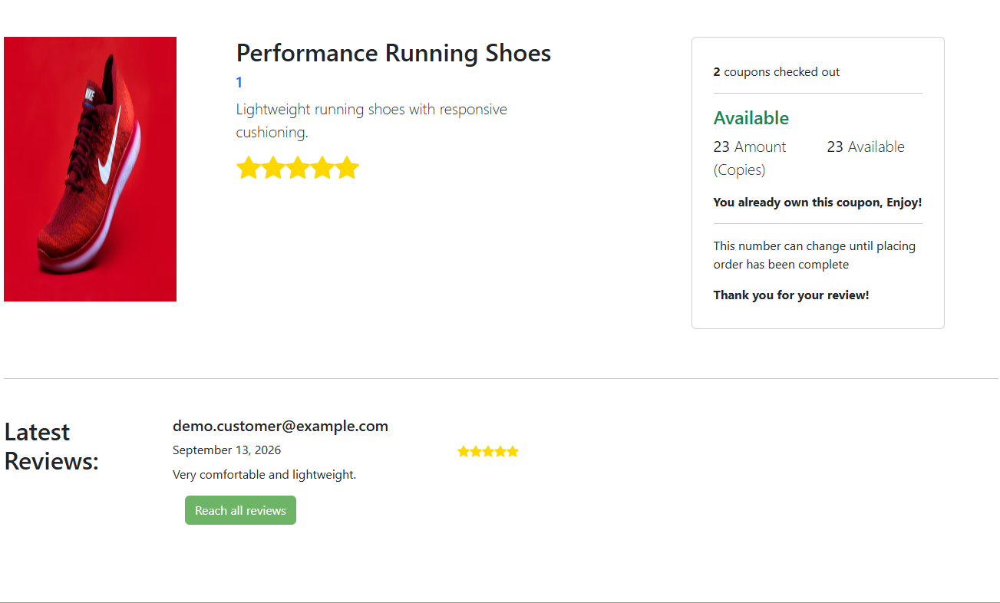
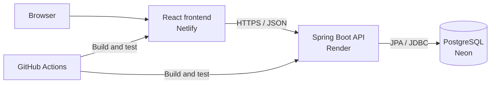
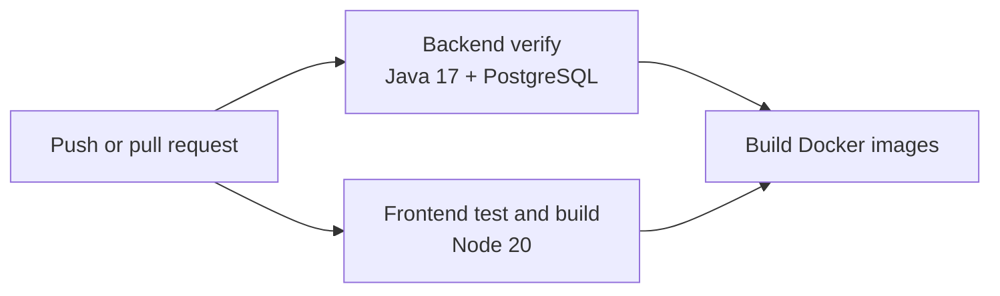

# Coupon System

[](https://github.com/Alexplokhikh/Coupon-system-website-project/actions/workflows/ci.yml)
[](https://coupon-system-alex-plokhikh.netlify.app)
[](https://openjdk.org/)
[](https://spring.io/projects/spring-boot)
[](https://react.dev/)
[](https://www.postgresql.org/)

A full-stack coupon marketplace where customers can discover and purchase offers, while companies can manage their coupon catalog. The application combines a React and TypeScript frontend with a secured Spring Boot REST API, PostgreSQL persistence, Docker-based local development, and automated CI.



## Live demo

| Resource    | URL                                                                                                                |
| ----------- | ------------------------------------------------------------------------------------------------------------------ |
| Frontend    | [coupon-system-alex-plokhikh.netlify.app](https://coupon-system-alex-plokhikh.netlify.app)                         |
| Backend API | [coupon-system-backend-pxtl.onrender.com/api/coupons](https://coupon-system-backend-pxtl.onrender.com/api/coupons) |
| CI pipeline | [GitHub Actions](https://github.com/Alexplokhikh/Coupon-system-website-project/actions/workflows/ci.yml)           |

Demo customer credentials:

```text
Email: demo.customer@example.com
Password: Demo123!
```

> The backend uses Render's free service tier and spins down after inactivity. The first request after a quiet period can take approximately one minute while the service wakes up.

## Features

### Customers

- Browse and search the coupon catalog
- Filter coupons by category with case-insensitive matching
- View prices, availability, expiration dates, ratings, and reviews
- Register and authenticate using JWT-based security
- Purchase available coupons
- Review current purchases and purchase history
- Leave coupon ratings and written reviews

### Companies

- Register a company account
- Access a role-aware management interface
- Create coupons with category, dates, inventory, price, description, and image
- Manage the company coupon catalog

### Platform

- Responsive React interface for desktop and mobile
- Customer and company authorization roles
- Public catalog endpoints and protected account endpoints
- Persistent PostgreSQL storage
- Sanitized, idempotent demo data
- Docker Compose development environment
- Automated backend, frontend, and Docker image checks
- Automatic deployments from the `modernization` branch

## Screenshots

### Coupon discovery

Browse the complete catalog or narrow the results using category and title-based search.

| Coupon catalog                                                        | Category filtering                                                 |
| --------------------------------------------------------------------- | ------------------------------------------------------------------ |
|  |  |

### Coupon details and customer activity

Authenticated customers can purchase coupons, monitor availability, and submit ratings and written reviews.



### Responsive interface

The navigation, promotional content, and coupon catalog adapt to smaller screens.

<p align="center">
  
</p>

## Architecture



### Production services

| Layer    | Service        | Purpose                                                 |
| -------- | -------------- | ------------------------------------------------------- |
| Frontend | Netlify        | Builds and serves the React single-page application     |
| Backend  | Render         | Builds the Docker image and runs the Spring Boot API    |
| Database | Neon           | Hosts the serverless PostgreSQL database                |
| CI       | GitHub Actions | Tests both applications and verifies both Docker images |

All deployed components currently use free service tiers. Availability and quotas remain subject to each provider's free-tier policies.

## Technology stack

### Frontend

- React 18
- TypeScript 4.9
- React Router 6
- Redux Toolkit and React Redux
- Reactstrap and Bootstrap
- Create React App

### Backend

- Java 17
- Spring Boot 3.0.3
- Spring Web and Spring Data REST
- Spring Data JPA and Hibernate
- Spring Security
- JSON Web Tokens with JJWT 0.11.5
- PostgreSQL JDBC driver
- Maven Wrapper

### Delivery

- Docker and Docker Compose
- Nginx production frontend image
- Multi-stage Docker builds
- GitHub Actions continuous integration
- Netlify, Render, and Neon deployment

## Run locally with Docker

### Prerequisites

- Git
- Docker Desktop with Docker Compose

### Setup

```bash
git clone https://github.com/Alexplokhikh/Coupon-system-website-project.git
cd Coupon-system-website-project
git checkout modernization
cp .env.example .env
```

Generate a JWT signing secret:

```bash
openssl rand -base64 32
```

Open `.env` and set at least:

```dotenv
DB_PASSWORD=choose-a-local-database-password
JWT_SECRET=paste-the-generated-secret-here
```

Build and start the full stack:

```bash
docker compose up -d --build
```

Open:

- Frontend: http://localhost:3000
- Backend catalog API: http://localhost:8080/api/coupons

Check container status and backend logs:

```bash
docker compose ps
docker compose logs -f backend
```

Stop the application:

```bash
docker compose down
```

PostgreSQL data remains in a named Docker volume unless the stack is removed with the `--volumes` option.

## Configuration

Runtime configuration is supplied through environment variables. Real credentials must never be committed.

| Variable               | Purpose                        | Local default/example                        |
| ---------------------- | ------------------------------ | -------------------------------------------- |
| `DB_URL`               | PostgreSQL JDBC connection URL | `jdbc:postgresql://localhost:5432/cs_app_db` |
| `DB_USERNAME`          | PostgreSQL role                | `postgres`                                   |
| `DB_PASSWORD`          | PostgreSQL password            | Required by Docker Compose                   |
| `JWT_SECRET`           | Base64 JWT signing key         | Required                                     |
| `HIBERNATE_DDL_AUTO`   | Hibernate schema strategy      | `update`                                     |
| `SHOW_SQL`             | SQL logging toggle             | `false`                                      |
| `CORS_ALLOWED_ORIGINS` | Permitted frontend origins     | `http://localhost:3000`                      |
| `DEMO_DATA_ENABLED`    | Enables sanitized demo records | `true` locally                               |
| `REACT_APP_API_URL`    | Frontend API origin            | `http://localhost:8080`                      |
| `FRONTEND_PORT`        | Published frontend port        | `3000`                                       |

Use `.env.example` as the safe configuration template. Keep `.env` local and private.

## Security model

- Passwords are encoded before persistence.
- Successful authentication returns a signed JWT.
- The frontend sends the token for protected operations.
- `/api/**` catalog resources and `/auth/**` authentication routes are public.
- `/secure/**` account routes require authentication.
- Access is stateless; server-side HTTP sessions are not used.
- CORS origins and the JWT secret are environment-specific.
- Internal user, customer, and company repositories are not exposed through Spring Data REST.

## Continuous integration

The workflow in `.github/workflows/ci.yml` runs on pushes and pull requests targeting `main` or `modernization`.



The pipeline performs:

1. Backend verification against a PostgreSQL service container
2. Frontend tests and an optimized production build
3. Independent backend and frontend Docker image builds

## Project structure

```text
.
├── Backend/                 Spring Boot API
│   ├── src/main/java/       Controllers, services, entities and security
│   ├── src/main/resources/  Application configuration
│   └── Dockerfile           Backend production image
├── Frontend/                React and TypeScript SPA
│   ├── src/                 Pages, components, authentication and state
│   ├── Dockerfile           Frontend production image
│   └── nginx.conf           SPA routing and static delivery
├── docs/screenshots/        README application screenshots
├── .github/workflows/       Continuous integration
├── docker-compose.yml       Local full-stack environment
├── netlify.toml             Frontend deployment configuration
└── .env.example             Safe environment template
```

## Modernization highlights

This project was upgraded from a locally oriented application into a deployable full-stack portfolio project:

- Migrated persistence from MySQL to PostgreSQL
- Added environment-based configuration for secrets and service URLs
- Added JWT signing-key validation and rotation support
- Added configurable CORS protection
- Added sanitized and idempotent demo data
- Containerized the frontend and backend
- Added Docker Compose health checks and persistent storage
- Added GitHub Actions verification for Java, React, and Docker
- Deployed the frontend, backend, and database on separate cloud services
- Fixed PostgreSQL search behavior with case-insensitive title and category queries
- Added SPA redirect configuration for direct-route navigation

## Known limitations

- The Render free instance can introduce a cold-start delay after inactivity.
- Free-tier availability and quotas are controlled by the hosting providers.
- Demo data is intended for portfolio evaluation rather than real transactions.
- The application does not integrate with a production payment provider.

## Author

Built and modernized by [Alex Plokhikh](https://plokhikh.netlify.app/).

- [GitHub](https://github.com/Alexplokhikh)
- [Portfolio](https://plokhikh.netlify.app/)
